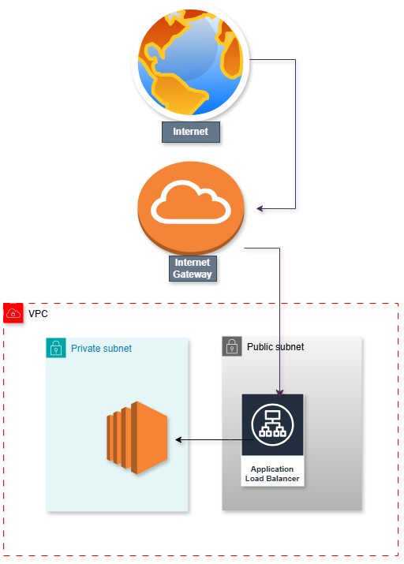
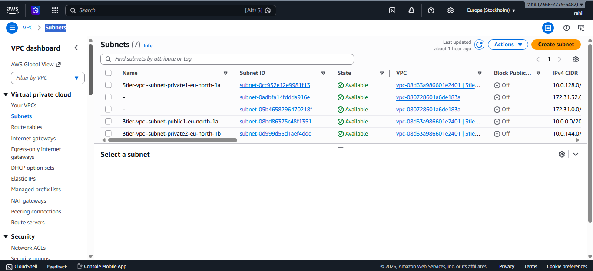
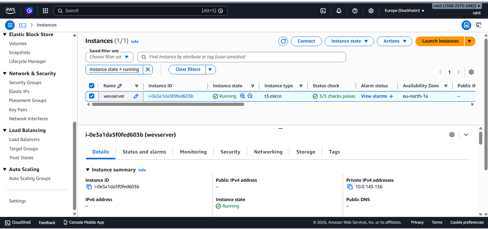
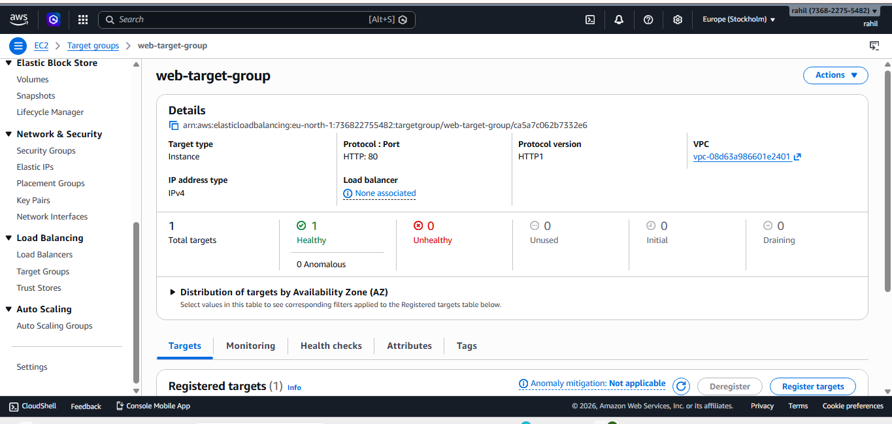
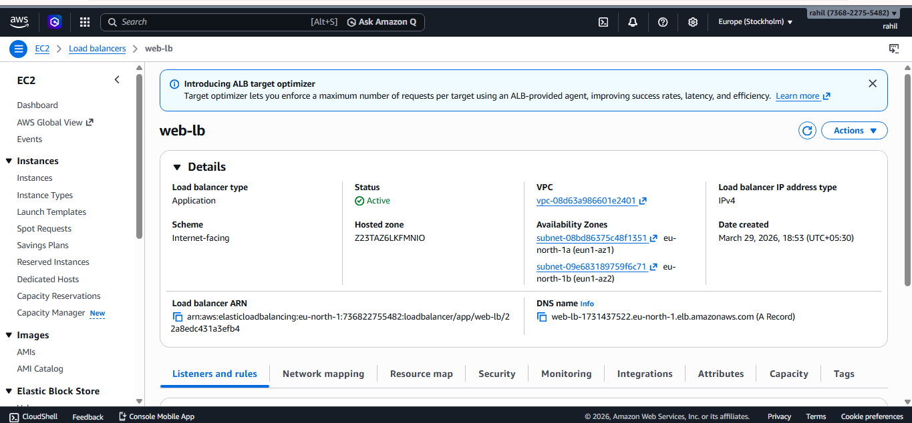
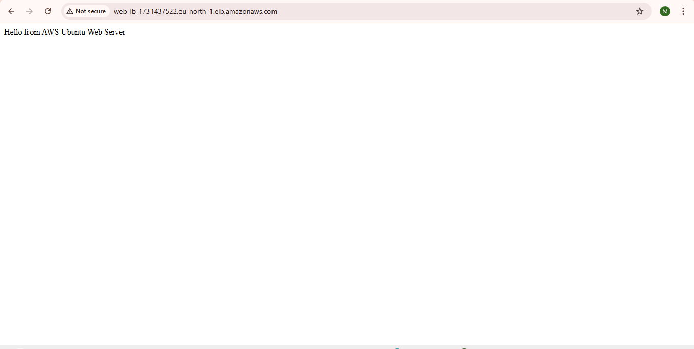

# AWS 3-Tier Architecture with Application Load Balancer

## Project Overview

This project demonstrates how to deploy a scalable and highly available web application using AWS services.

The architecture uses a custom VPC with public and private subnets, an Internet Gateway, a NAT Gateway, an EC2 web server, and an Application Load Balancer to distribute traffic.

---

## Architecture Diagram

---

## AWS Services Used

- Amazon VPC
- Public and Private Subnets
- Internet Gateway
- NAT Gateway
- EC2 (Ubuntu Web Server)
- Application Load Balancer
- Target Groups
- Security Groups
- Route Tables

---

## Architecture Flow

Internet  
↓  
Internet Gateway  
↓  
Application Load Balancer (Public Subnets)  
↓  
Target Group  
↓  
EC2 Web Server (Private Subnet)

---

## Steps Performed

1. Created a custom VPC with CIDR block `10.0.0.0/16`
2. Created public and private subnets across two availability zones
3. Attached an Internet Gateway for public access
4. Configured route tables for public and private subnets
5. Created a NAT Gateway for private subnet internet access
6. Launched an EC2 instance in a private subnet
7. Installed and configured Apache Web Server
8. Created a target group and registered the EC2 instance
9. Created an Application Load Balancer
10. Configured listener rules to forward HTTP traffic to the target group

---

## Screenshots

### Subnets

### EC2 Instance

### Target Group Health Check

### Application Load Balancer

### Web Server Output

---

## Outcome

Successfully deployed a highly available web application architecture using AWS networking components and load balancing.

This project demonstrates practical knowledge of AWS VPC networking, EC2 deployment, and load balancing.
